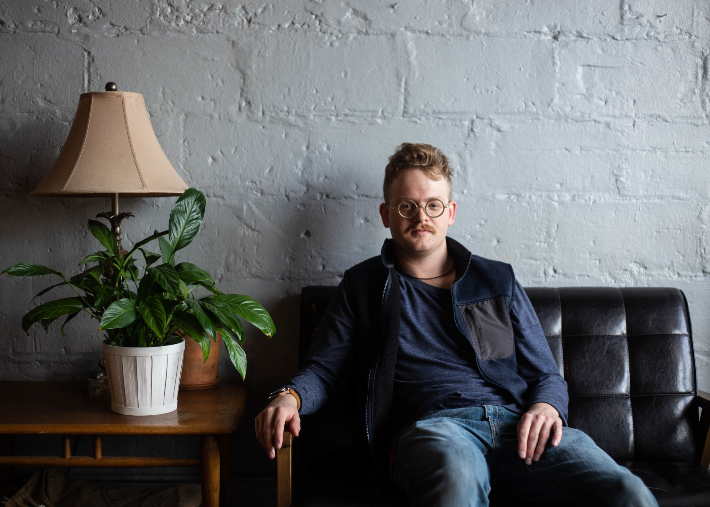

# Isaac Yates

Web Developer | Barista

## Technical Overview

Over the last couple years since leaving college I've been learning ReactJS, NextJS, Svelte & Sveltekit (used to be Sapper), ExpressJS, MongoDb, and the basics of HTTP. I've also worked with TailwindCSS, Bootstrap, and SASS. I have passing familiarity with Django, Flask, Docker, and Docker-Compose. For my personal projects, I deploy to Vercel and host images on AWS S3. I've become a big fan of fullstack Javascript, but I'm looking to get involved in fullstack, frontend, or backend web development.

## Philosophy

I would like to build experiences that interface with real life, as opposed to swallowing users into the depths of the internet. Technology is best used when it augments and boosts our relationships with nature, the universe, and other people.

## Projects

You can see my favorite projects stickied to my profile below. Here is quick summary of each:

### [Take Ike's Stuff]()

Sort of like a digital give-away or garage sale, takeikesstuff is a web app I built to help me transition into a more minimalist life style while also supporting my friends in need to stuff. _Built with NextJS, JWT, AWS S3, Mongodb, and TailwindCSS._

### [Clock In/Out]()

Clock In/Out is a simple time recording app for those of us who don't want to track their hours on paper. _Built with NextJs, Auth0, Mongodb, and TailwindCSS._

### [Yates Creative]()

Yates Creative is the home to my creative pursuits. It includes a portfolio, some poetry, pictures of my latte art, and whatever else comes my mind. _Built with NextJS, Mongodb, AWS S3, and TailwindCSS._

## Contact / Hire Me

Please, if you're hiring or would like to chit chat, shoot me a message on my [LinkedIn](https://www.linkedin.com/in/isaac-yates-572441116/) profile or drop me a message via [this handy form](https://yatescreative.com/contact) on my website.

